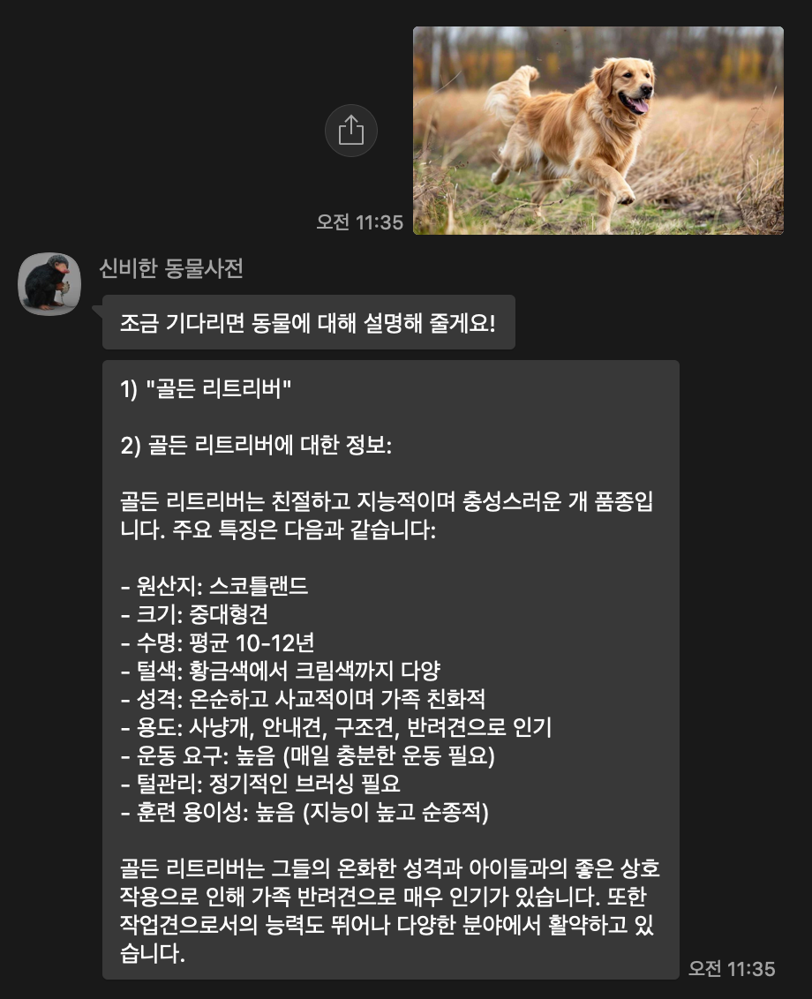
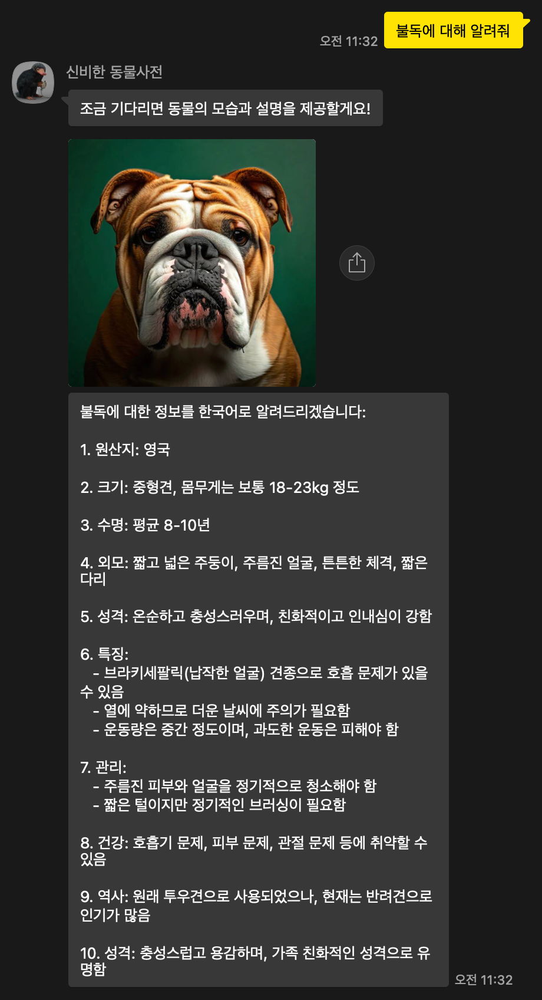
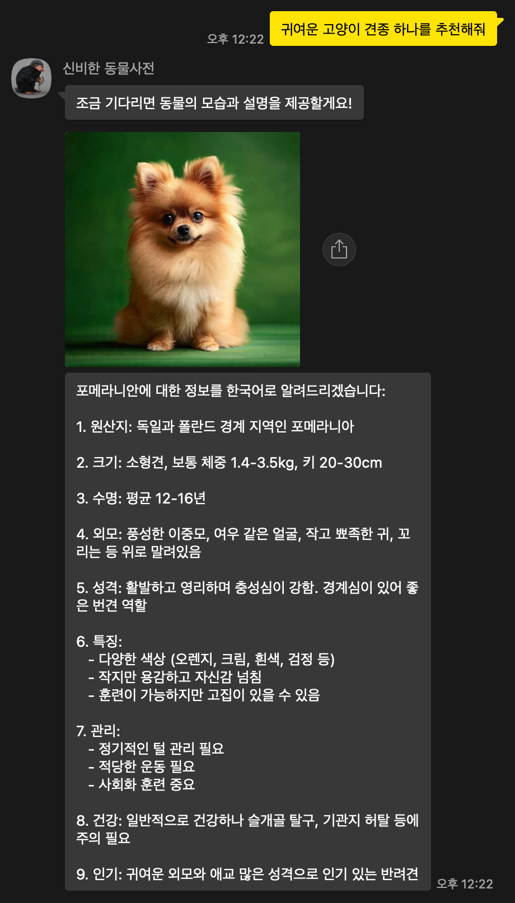
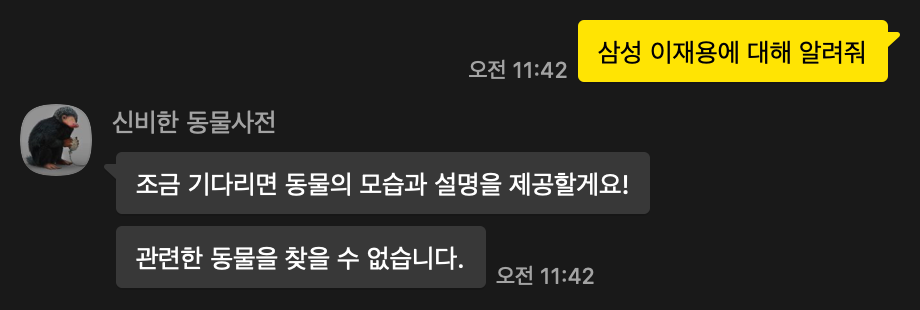

# 신비한 동물사전
AWS 해커톤-흑백개발자에 쓰였던 신비한 동물사전 카카오톡 챗봇

## 배포
```
# 1st Deployment
sam build & sam deploy --guided --capabilities CAPABILITY_NAMED_IAM

# Update
sam build & sam deploy --no-confirm-changeset --no-disable-rollback --capabilities CAPABILITY_NAMED_IAM
```

## 시연
이미지 처리

텍스트 처리

견종 추천

유효하지 않은 요청


## 역할
- [ArcoKim](https://github.com/ArcoKim) : 팀 리더, 이미지 처리 API 개발
- [twemmi](https://github.com/twemmi) : 생성형 AI 프롬프트 엔지니어링
- [sskskfskfj](https://github.com/sskskfskfj) : 프레젠테이션, 아키텍처 설계
- [pybsh](https://github.com/pybsh) : 텍스트 처리 API 개발